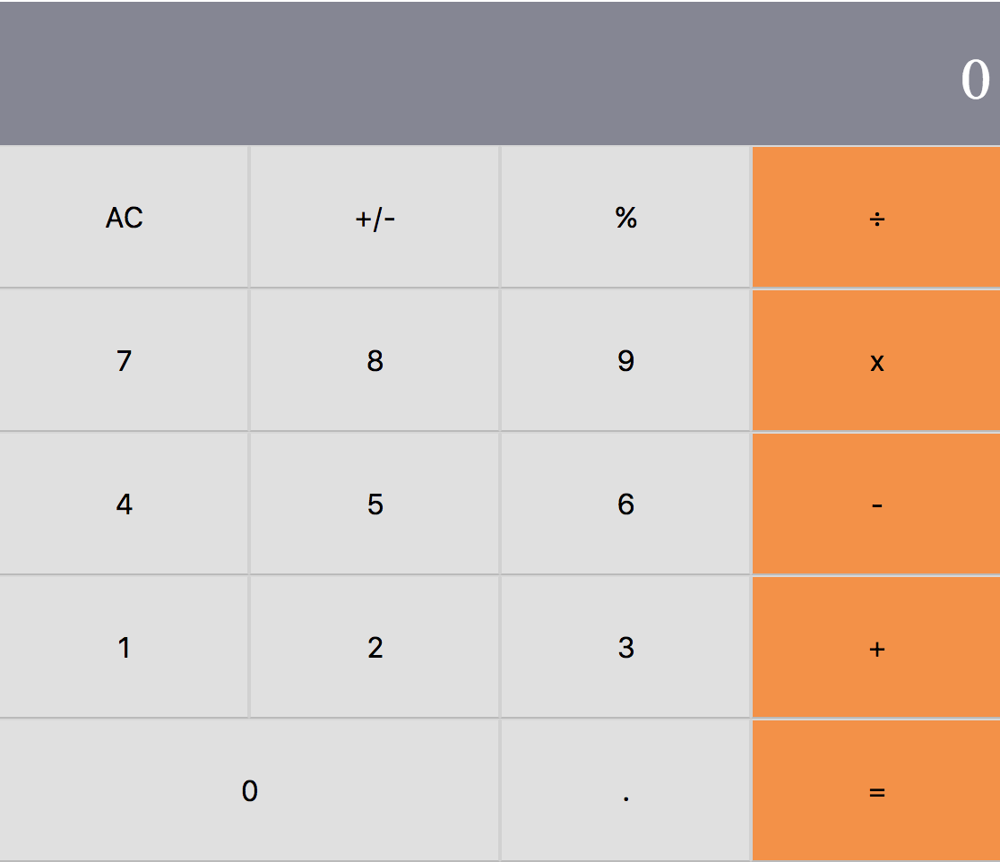

 
<h1 align="center">React Project - Calculator</h1>

## Table of Contents

* [About the Project](#about-the-project)
  * [Built With](#built-with)
* [Run This App](#run-this-app)
* [License](#license)
* [Contact](#contact)

## About The Project

The goal of this project is build a calculator using create-react-app, a tool built by developers at Facebook to help you build React applications, saving you from time-consuming setup and configuration.

### Basic project structure

* Create a react app with create-react-app;
* Delete the unnecessary file and assets;
* Add the big.js;
* Verify if everything is ok;
* Deploy to Heroku (https://calc-app-react.herokuapp.com/).

### Create components

* Prepare the directory structure;
* Implement the App component;
* Implement the Display component;
* Implement the Button component;
* Implement the ButtonPanel component.

### Adding Styling

* Use grid display mode for App, Display and ButtonPanel component;
* Style the Display component;
* Style the ButtonPanel component;
* Style the Button component;
* Pass “color” and “wide” props to the Button.

### Calculations 

* Preparation;
* Implement the calculate.js module;
* Implement the operate.js module
* Add calculate.js to the App component

### Event handlers 

* App component
* ButtonPanel
* Button

### Built With 

* Node.js
* React
* React-DOM
* React-Create-App
* npm
* CSS
* ES6

## License

Distributed under the MIT License. See `LICENSE` for more information.

## Contact
* Felipe Enne - felipeenne@gmail.com | [Github Account https://github.com/FelipeEnne](https://github.com/FelipeEnne)

